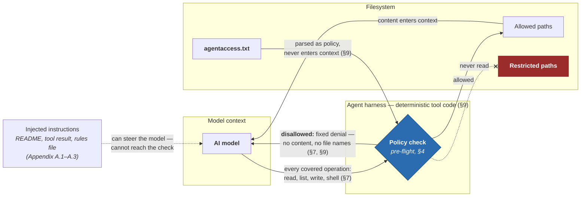

# agentaccess.txt

A plain-text file that declares which agentic AI tools may operate in a directory tree — and on which paths. Modeled on `robots.txt`; complementary to `AGENTS.md`.

**`AGENTS.md` tells agents how to work in a project; `agentaccess.txt` tells them whether they may.**

## The two-line version

Put this in any directory you want AI tools to leave alone:

```
Agent: *
Disallow: /
```

Every conforming agent — CLI tool, IDE integration, background indexer — checks for this file *before* reading anything else in the tree, and stays out.

## Why

**Install a new AI tool and it starts with an empty ignore list: nothing warns you as it reads everything the other tools were told to leave alone.** Developers run several agentic AI tools side by side, and not every tool is appropriate for every directory: a client repository under NDA, a sensitive internal project, a personal-notes folder. Today that intent can only be expressed per tool — `.cursorignore`, `.aiexclude`, `.aiignore`, JetBrains' `.noai`, per-workspace IDE settings — and **the rules don't travel: every restriction must be repeated in every tool's own list, on every machine. That multiplication is where restrictions quietly die.** Forget one path in one list and that tool simply reads what the others skip. Worse, existing ignore files answer the wrong question: they say *which paths* to exclude, uniformly, but none can say *which tools* are welcome.

Nor is this only a developer's problem anymore. AI features are arriving in desktop apps that organize folders, summarize documents, and generate images — tools whose users have never heard of an ignore file, and whose "workspace" is a home directory full of contracts, journals, and tax records. Those folders need the same one-file way to say *stay out* — and their owners are worse off than developers today: a developer at least has per-tool ignore files to maintain, while a desktop user has no way or know-how to express the restriction at all.

**`agentaccess.txt` puts the restriction in the directory itself, declared once by the directory's owner, honored by every conforming agent on any machine.** And because the file is committed, it travels beyond your machines entirely: a cloud agent cloning the repository or a forge-side indexing pipeline sees the same declaration — a place no per-machine ignore list or workspace setting can reach. Per-agent rules use the familiar `robots.txt` ([RFC 9309](https://www.rfc-editor.org/rfc/rfc9309)) grammar:

```
# Default: no agentic AI tools.
Agent: *
Disallow: /

# Claude Code may work in docs and public source, nothing else.
Agent: anthropic/claude-code
Allow: /docs/
Allow: /src/public/
Disallow: /
```

Rules match individual files too, not only directories: `Disallow: /*.env$` blocks every `.env` file in the tree (see the [examples](examples/)).

The convention does not remove the need to vet your tools — it changes what vetting means. Instead of maintaining one configuration entry per path, per tool, per machine, you ask one checkable question of each tool you choose to run: does it honor `agentaccess.txt`? The [registry](REGISTRY.md) records which tools claim to. The policy itself remains your job — you write it, keep it truthful, and review changes to it like any security-relevant file.

And **why would vendors honor a text file?** Because unlike `robots.txt` — a precedent that is [visibly eroding](https://blog.cloudflare.com/perplexity-is-using-stealth-undeclared-crawlers-to-evade-website-no-crawl-directives/) — this signal is created by the vendor's own customer: a crawler's paying customer is not the site it scrapes, but **an agent's paying customer is the very person who wrote the restriction file. Honoring `agentaccess.txt` is a product feature, not a courtesy to a stranger.** The alignment is strongest where author and user coincide — your notes, your organization's repositories; where they diverge (a contractor's tool inside a client's restricted repository), the file offers declared intent and an audit trail rather than aligned incentives.

## What it is not

**Not a security boundary.** Like `robots.txt`, **this is a cooperative signal**, not enforcement: it cannot stop a determined actor. A tool that simply doesn't implement the convention fails as silently as a forgotten ignore-list entry: the file gives you leverage over conforming tools, not assurance over every process on your machine. And the leverage runs one way: the file governs what may *enter* model context, not what may leave it — an agent can still be steered into sending out content it was allowed to read. It is also not an instruction file for agents (that's [`AGENTS.md`](https://agents.md)) and not a path-exclusion list for tools that are otherwise permitted (that's `.agentignore` and friends). See the [spec](SPEC.md) §2, §8, and §9, and the [FAQ](FAQ.md).

**What it does change, security-wise,** is which *class* of attack can reach restricted paths: enforced in tool code rather than model judgment, the policy holds even when the model is steered — so prompt injection hidden in a README, a rules file, or a poisoned tool result no longer suffices, and **an attacker instead needs a hostile process on the machine, a far rarer and harder position. The threat is demoted, not eliminated;** [Appendix A](SPEC.md#appendix-a-threat-classes-and-degree-of-mitigation) of the spec surveys the documented attack classes and states honestly how much each one changes.



*Holds for conforming agents: a non-conforming or compromised process bypasses everything above ([Appendix A.5](SPEC.md#a5-compromised-agent-distribution)).*

## Documentation

- **[Specification](SPEC.md)** — Draft 00, the normative document.
- **[Examples](examples/)** — commented `agentaccess.txt` files for common cases; copy-paste and edit.
- **[FAQ](FAQ.md)** — "it's voluntary, so what's the point?" and other fair objections, answered.
- **[Registry](REGISTRY.md)** — canonical agent identifiers (`anthropic/claude-code`, `google/gemini-cli`, …).
- **[Contributing](CONTRIBUTING.md)** — how to propose spec changes and how vendors register an identifier.

This repository carries its own [`agentaccess.txt`](agentaccess.txt), naturally.

## Status

**Draft 00 — open for community discussion.** This proposal is new; no tool implements it yet, and the [registry](REGISTRY.md) will track vendor adoption as it happens. Conformance has a familiar shape: every major tool already enforces its own ignore mechanism in deterministic tool code, so the core of the convention — parse the file, apply the rules to file access — is one more policy source in a filter engine each vendor already operates. The honest cost is coverage: the [spec](SPEC.md)'s conformance bar includes shell commands the agent runs, which most engines do not yet check even for their own ignore files — work that, once done, hardens those too. The spec ends with a list of [open questions](SPEC.md#11-open-questions-for-discussion); issues and discussion are welcome. Nothing here is final, including the grammar.

## License

Text of this repository, including the specification: [CC BY 4.0](LICENSE).
